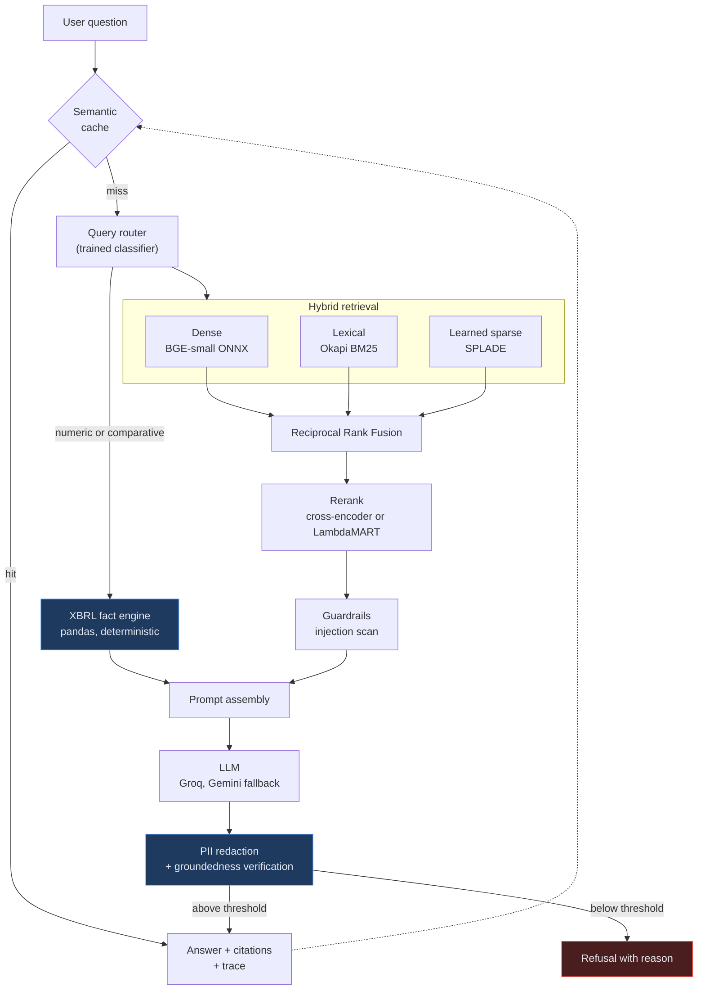

# sec-rag-platform

**Evaluation-driven retrieval-augmented generation over SEC filings.**

[](https://github.com/adwitiyashukla/sec-rag-platform/actions/workflows/ci.yml)
[](https://github.com/adwitiyashukla/sec-rag-platform/actions/workflows/eval.yml)
[](https://www.python.org)
[](LICENSE)
[](https://huggingface.co/spaces/adwitiyashukla/sec-rag-platform)

**[Try the live demo](https://huggingface.co/spaces/adwitiyashukla/sec-rag-platform)**

A question answering system over 10-K filings that hybrid-retrieves across three
independent arms, reranks with a cross-encoder, computes financial figures from
filed XBRL data rather than generating them, verifies that every answer is
supported by the passages it cites, and **fails its own build when retrieval or
answer quality regresses.**

---

## The problem this is built around

Most RAG projects stop at "documents in, answer out." That is a weekend
tutorial. The engineering problems that actually matter show up afterwards:

**You cannot tell when it gets worse.** Change the chunk size, swap an embedding
model, adjust a prompt, and quality moves. Without a fixed golden set and a
threshold gate, "the retrieval got better" is an opinion. Here it is a number in
CI, and a regression fails the build.

**Language models cannot read financial tables.** A 10-K table spans multiple
periods, nests headers, and carries scaling captions far from the figures they
govern. Ask a model for revenue growth and it produces something plausible and
wrong. That is the worst failure mode on financial data: confident, specific,
and unverifiable at a glance. So numbers are not generated here at all. They are
looked up in the SEC's structured XBRL data and computed in pandas, and every
figure carries its formula and inputs.

**A citation is not evidence.** An answer that cites `[2]` is not thereby
supported by `[2]`. Every sentence is checked against the passage it cites, and
answers scoring below a groundedness threshold are withheld with an explanation
rather than returned with a disclaimer.

---

## Architecture



Each retrieval arm fails differently, which is the reason to keep all three.
Dense retrieval understands paraphrase but blurs near-identical identifiers, so
"Item 9A" and "Item 9B" land in nearly the same place. BM25 is exact but blind
to synonyms. SPLADE expands terms in learned rather than lexical space. Fusing
them recovers documents any single arm would have missed.

---

## What is measured

Every number below is produced by `secrag benchmark` and `secrag eval` against
the golden set in [`evals/goldens/golden_set.json`](evals/goldens/golden_set.json),
and regenerated in CI. Nothing here is an estimate.

<!-- BENCHMARK:START -->
Corpus: **3,629 chunks** across 33 golden queries. Dense `BAAI/bge-small-en-v1.5`, sparse `prithivida/Splade_PP_en_v1`, reranker `Xenova/ms-marco-MiniLM-L-6-v2`. Latency is single-threaded CPU.

| Configuration | nDCG@6 | Hit@6 | MRR | P@6 | Mean ms | p95 ms |
|---|---:|---:|---:|---:|---:|---:|
| dense only | 0.710 | 0.818 | 0.680 | 0.550 | 87 | 159 |
| bm25 only | 0.670 | 0.758 | 0.649 | 0.495 | 10 | 12 |
| splade only | 0.775 | 0.939 | 0.731 | 0.545 | 424 | 459 |
| dense + bm25 | 0.709 | 0.818 | 0.683 | 0.550 | 87 | 119 |
| dense + bm25 + splade | 0.735 | 0.879 | 0.682 | 0.601 | 874 | 1008 |
| hybrid + LTR \* | 0.939 | 0.939 | 0.939 | 0.929 | 862 | 1017 |
| hybrid + cross-encoder | 0.770 | 0.879 | 0.737 | 0.561 | 3180 | 3597 |

\* Trained on these same queries, so this row is training-set performance and is optimistic. Its honest grouped cross-validation score is reported separately below.

Best configuration that is not scored in-sample is **splade only** at nDCG@6 0.775, **+9.2%** against dense-only retrieval (0.710). It costs 424 ms mean against 87 ms.

**Reading this honestly.** Three things in that table are worth stating plainly rather than glossing over:

- Learned sparse retrieval alone (0.775) beats dense alone (0.710) on this corpus, and beats three-arm fusion (0.735). Fusion is not free: mixing in weaker arms can pull a strong one down.
- The cross-encoder's gain over fusion is real but modest, and it costs roughly 3.6x the latency. Whether that trade is worth making depends entirely on the application.
- With only 33 queries, differences below roughly 0.05 nDCG should not be treated as meaningful. The suite is sized to catch regressions, not to rank models.

**The learning-to-rank reranker.** Trained on the golden set, so its row above is training-set performance. Under grouped cross-validation, splitting by query so no query appears in both folds, it scores **nDCG 0.685** against **0.618** for plain fusion order, a lift of **+0.067** over 30 queries and 1,200 candidates. That is the number to believe.

Its most informative features, by gain: `section_id` (281), `rrf_score` (184), `numeric_density` (112), `token_estimate` (87). That `section_id` dominates is a real finding: which 10-K Item a passage came from predicts relevance better than any similarity score, which is why section is a first-class field throughout the pipeline rather than loose metadata.
<!-- BENCHMARK:END -->

### Query router

Intent classification over dense embeddings plus explicit lexical signals,
scored by 5-fold cross-validation so the number comes from folds the model never
saw.

<!-- ROUTER:START -->
| Metric | Value |
|---|---:|
| Cross-validated accuracy | **0.960** |
| Macro F1 | 0.960 |
| Labelled examples | 101 |
| Features | 392 (384 dense + 8 lexical) |

Per-class F1: `comparative` 0.957, `factoid` 0.947, `multi_hop` 0.957, `numeric` 0.981.
<!-- ROUTER:END -->

The pair that motivates the whole router:

| Question | Route | Why it matters |
|---|---|---|
| "What was Apple's revenue in fiscal 2024?" | `numeric` | Answer computed from XBRL |
| "What does Apple say about revenue growth drivers?" | `factoid` | Answer read from the narrative |

Both mention revenue and a company. Only the first wants a figure. Routing the
second to the arithmetic engine returns nothing useful; routing the first to the
language model invites a fabricated number.

### Answer quality

Measured with the offline provider, which is why the numbers are reproducible.
Retrieval and routing metrics do not involve a language model at all. Citation
and groundedness metrics do, and the offline provider writes extractive answers,
so they measure whether the citation and verification machinery works rather
than how well a particular model writes. Configure a real provider and re-run
`secrag eval` to measure that.

<!-- EVAL:START -->
33 golden cases against 3,629 indexed chunks, reranker `cross_encoder`, provider `echo:echo-1`.

| Metric | Value | CI threshold | | What it means |
|---|---:|---:|:--:|---|
| Hit rate@6 | **0.879** | 0.80 | pass | at least one relevant passage in the top 6 |
| nDCG@6 | **0.763** | 0.68 | pass | ranking quality |
| MRR | **0.737** | 0.65 | pass | rank of the first relevant passage |
| Citation validity | **1.000** | 0.95 | pass | markers that point at a real source |
| Groundedness | **0.781** | 0.65 | pass | answer sentences supported by their citation |
| Numeric accuracy | **1.000** | 0.90 | pass | XBRL figures within tolerance |
| Routing accuracy | **0.970** | 0.85 | pass | intent matched the golden label |
| Refusal correctness | **0.970** | 0.85 | pass | declined exactly when it should |

The gate passes. Thresholds live in [`evals/thresholds.json`](evals/thresholds.json) and are enforced by `secrag eval --gate` in CI.
<!-- EVAL:END -->

---

## Two bugs worth reading about

Both were caught by tests written against real data, and both are the kind that
produce a system that looks like it works.

### Quarterly figures read as annual

SEC XBRL observations carry `fp` and `fy` fields. Those describe the *report*
the fact appeared in, not the period the fact covers. A 10-K also tags its
fourth-quarter figures, and those carry `fp="FY"` and `form="10-K"` as well.

Filtering on those fields alone admits quarterly values as annual ones. Apple's
FY2020 revenue then reads as **64.7 billion**, its Q4 figure, instead of
**274.5 billion**, and every growth rate computed from it is wrong while looking
entirely reasonable. FY2021 growth showed as 465 percent.

The fix selects annual facts by measuring each observation's actual
start-to-end duration, and labels fiscal years by the period midpoint so a
January year-end is not shifted forward. See
[ADR 0003](docs/adr/0003-xbrl-for-numbers.md) and
`tests/unit/test_xbrl_and_planner.py`.

### The query prefix that is silently missing

BGE v1.5 was trained with an asymmetric instruction prefix applied to queries
only. `fastembed` does not apply it: `query_embed`, `passage_embed`, and `embed`
all return identical vectors, verified by comparison. The correctly prefixed
query differs from the unprefixed one at cosine **0.969**.

Omitting it is not an error. Retrieval still returns results, they are simply
measurably worse. It is applied explicitly in `Embedder.embed_query` for that
reason. See [ADR 0001](docs/adr/0001-onnx-over-pytorch.md).

---

## Quickstart

```bash
git clone https://github.com/adwitiyashukla/sec-rag-platform.git
cd sec-rag-platform

python -m venv .venv && source .venv/bin/activate      # Windows: .venv\Scripts\activate
pip install -e ".[dev]"

cp .env.example .env        # add a free Groq or Gemini key, and your contact email
```

EDGAR requires a descriptive `User-Agent` containing a contact address. Set
`SECRAG_EDGAR_USER_AGENT` before ingesting or requests will be refused.

```bash
secrag ingest              # fetch, chunk, embed, and index the demo corpus
secrag train-router        # train the intent classifier
secrag train-ltr           # train the learning-to-rank reranker

secrag query "What supply chain risks does Apple disclose?"
secrag query "What was Apple's gross margin in fiscal 2024?"

secrag eval --gate         # run the golden set, exit non-zero on regression
secrag benchmark           # ablate retrieval arms and rerankers

secrag serve               # API and web UI on http://localhost:7860
```

Docker:

```bash
docker compose up --build
```

The image pre-bakes the ONNX weights, so the container starts in about five
seconds rather than downloading models on first request.

### Running with no API key

The whole test and evaluation suite runs offline. `EchoProvider` parses the
retrieved context out of the prompt and composes a real extractive answer with
real citations, so citation validity, groundedness, and refusal logic are all
exercised without a network call. That is why CI needs no secrets.

---

## Design decisions

Each of these is written up with its tradeoffs and what was given up:

| ADR | Decision |
|---|---|
| [0001](docs/adr/0001-onnx-over-pytorch.md) | ONNX Runtime instead of PyTorch: a 51 MB inference stack instead of one measured in gigabytes |
| [0002](docs/adr/0002-hybrid-retrieval-rrf.md) | Fuse retrieval arms by rank, not by score |
| [0003](docs/adr/0003-xbrl-for-numbers.md) | Compute figures from XBRL, never generate them |
| [0004](docs/adr/0004-groundedness-without-a-judge.md) | Verify groundedness deterministically, without a judge model |
| [0005](docs/adr/0005-deterministic-offline-provider.md) | Ship a deterministic offline provider so CI needs no keys |
| [0006](docs/adr/0006-embedded-qdrant.md) | Embedded Qdrant, with BM25 derived from it |

---

## API

| Endpoint | Purpose |
|---|---|
| `POST /v1/query` | Answer with citations, verified figures, groundedness score |
| `POST /v1/query/stream` | Server-sent events. Sources arrive before the first token |
| `GET /v1/stats` | Corpus size, models, provider chain, cache statistics |
| `GET /metrics` | Prometheus text exposition |
| `GET /health`, `GET /ready` | Liveness and readiness, separated deliberately |
| `GET /docs` | OpenAPI |

The [live demo](https://huggingface.co/spaces/adwitiyashukla/sec-rag-platform) runs a
Gradio front end over the same engine. Hugging Face made Docker Spaces a paid
feature, so the free tier serves Gradio; the FastAPI service above is what the
Docker image and `secrag serve` run, and both call identical code.

```bash
curl -s localhost:7860/v1/query \
  -H 'content-type: application/json' \
  -d '{"question":"What was Apple gross margin in fiscal 2024?","top_k":6}' | jq
```

Every response carries a `trace_id`, per-stage timings, token counts, and an
estimated cost at published list prices.

---

## Project layout

```
src/secrag/
├── core/           Settings, typed errors, domain models, logging
├── providers/      LLM abstraction: Groq, Gemini, deterministic offline
├── ingest/         EDGAR client, 10-K parser, chunker, XBRL fact engine
├── retrieval/      Embedder, Qdrant store, BM25, RRF fusion, rerankers
├── routing/        Query intent classifier and its labelled dataset
├── analytics/      Numeric query planner over XBRL facts
├── generation/     Prompts, synthesis, groundedness verification
├── guardrails/     Prompt-injection detection, PII redaction
├── evaluation/     Metrics, golden set, harness, ablation, LTR training
├── observability/  Tracing, token accounting, metrics registry
├── api/            FastAPI service
└── engine.py       The orchestrator that sequences all of it
```

---

## Limitations

Stated plainly, because a project that claims none is not being honest.

- **Relevance judgement is weak supervision.** A chunk counts as relevant when
  it comes from an expected 10-K Item and contains an expected term. That is a
  reproducible proxy, not human-labelled ground truth. It detects regressions
  reliably; it does not license absolute claims about recall.
- **Groundedness measures relatedness, not entailment.** Embedding similarity
  catches unsupported and off-topic claims. A sentence that contradicts its
  source while using its vocabulary can still score highly. Numeric claims,
  where inversion matters most, bypass the model entirely.
- **The router is overconfident out of distribution.** "Tell me about the
  weather" routes to `factoid` at 0.94. Retrieval then returns nothing relevant
  and the system refuses, so the failure is contained, but the confidence score
  should not be read as calibrated.
- **SPLADE is off by default in deployment.** It adds 532 MB against BGE's
  67 MB. It is benchmarked here and enabled with `SECRAG_ENABLE_SPLADE=true`.
- **Embedded Qdrant is single-process.** Correct at this corpus size, and the
  reason to move to a Qdrant server rather than to change the code.
- **The corpus is five companies over two years.** Enough to stress the parser
  across sectors, not a claim about scale.

---

## Acknowledgements

Filing data from the [SEC EDGAR](https://www.sec.gov/edgar) full-text and XBRL
APIs, used within their published rate limits. Reciprocal Rank Fusion follows
Cormack, Clarke, and Buettcher (2009).

## License

MIT. See [LICENSE](LICENSE).
